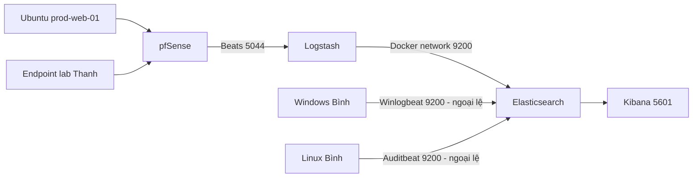

# Đối chiếu trạng thái Web Lab và ELK — 2026-10-08

Phạm vi: VMware/pfSense, Ubuntu web server, EC2 ELK và hai nguồn log của Bình. Tài liệu đã ẩn địa chỉ IP công khai, thông tin định danh endpoint và secret.

> **Ưu tiên bảo mật:** Kibana đang có thể truy cập từ Internet trong khi `xpack.security.enabled=false`. Ngoại lệ cho hai nguồn của Bình đi thẳng vào Elasticsearch `9200/TCP` được giữ tạm thời, nhưng chỉ được whitelist đúng nguồn `/32`.

## Trạng thái đã xác minh

| Thành phần | Quan sát | Kết luận |
|---|---|---|
| pfSense | VM chạy, làm gateway cho VMnet10 | Đạt |
| Ubuntu `prod-web-01` | Nginx và Flaskr active/enabled; HTTP trả `200` | Đạt cho lab |
| Web app | Flaskr + SQLite; Gunicorn chỉ bind `127.0.0.1:8000` | Đạt |
| Elasticsearch | `9.5.4`; cluster `yellow`, 1 node, replica chưa gán | Hoạt động; phù hợp single-node |
| Kibana | `9.5.4`; `5601/TCP` truy cập được từ ngoài | Hoạt động nhưng rủi ro cao |
| Logstash | `9.5.4`; pipeline `green`, Beats input `5044/TCP` | Sẵn sàng; chưa có event thật từ lab Thanh sau lần restart gần nhất |
| Windows của Bình | Winlogbeat `9.4.5`, data stream `.ds-winlogbeat-*` | Đi trực tiếp `9200/TCP` |
| Linux của Bình | Auditbeat `9.5.4`, data stream `.ds-auditbeat-*` | Đi trực tiếp `9200/TCP` |

## Kiến trúc hiện tại



Hai đường ingest có thể cùng tồn tại trong giai đoạn đồ án. Dữ liệu của Bình không bị ảnh hưởng khi Thanh dùng `5044/TCP`, nhưng dữ liệu đi thẳng `9200/TCP` không qua normalization của Logstash.

## Evidence -> Finding -> Path

### E-001 — Ubuntu web server

- `nginx` và `flaskr` active/enabled.
- Listener công khai của VM: SSH `22/TCP`, HTTP `80/TCP`.
- Gunicorn chỉ bind loopback `127.0.0.1:8000`.
- HTTP nội bộ trả `200`; SQLite có dữ liệu demo.

### E-002 — ELK

- Elasticsearch, Kibana và Logstash chạy bằng Docker Compose.
- Elasticsearch health `yellow`: 1 node, primary shard active, replica shard không thể gán sang node thứ hai.
- Logstash pipeline `green`, input Beats `5044/TCP`.
- Elastic security hiện tắt.

### E-003 — Đường ingest của Bình

- Có document trong data stream Winlogbeat và Auditbeat.
- Không có index `datn-*` tương ứng do output Logstash tạo.
- Logstash không ghi nhận lưu lượng tương ứng từ hai nguồn.

Kết luận: hai nguồn của Bình gửi thẳng đến Elasticsearch `9200/TCP`.

### F-001 — Kibana public khi security tắt

- Mức độ: **High**.
- Điều kiện: `5601/TCP` truy cập được từ Internet và `xpack.security.enabled=false`.
- Hành động: giới hạn Security Group về IP quản trị `/32` hoặc VPN/SSH tunnel; tiếp theo bật authentication/TLS.

### F-002 — API ELK được publish ra host

- Mức độ: **Medium** trong lab; **High** nếu Security Group mở rộng.
- `9200/TCP` chỉ giữ cho hai nguồn Bình trong giai đoạn chuyển tiếp.
- `9600/TCP` là API giám sát Logstash, không phải cổng ingest; đóng inbound Internet.

### F-003 — Hai đường ingest khác nhau

- Mức độ: **Accepted design exception**.
- Bình: endpoint -> Elasticsearch `9200/TCP`.
- Thanh: endpoint -> Logstash `5044/TCP` -> Elasticsearch.
- Ảnh hưởng: schema, index naming và parsing chưa đồng nhất; cần chuẩn hóa trước detection/dashboard chính thức.

### P-001 — Telemetry path

```text
Nguồn Bình -> SG 9200/TCP (/32) -> Elasticsearch -> data stream -> Kibana

Nguồn Thanh -> pfSense -> SG 5044/TCP (/32)
            -> Logstash -> Elasticsearch -> datn-* -> Kibana
```

## Ma trận cổng

| Cổng | Vai trò | Chính sách |
|---:|---|---|
| 22 | SSH | Chỉ IP quản trị `/32` hoặc SSM |
| 5044 | Beats -> Logstash | Giữ cho nguồn lab Thanh `/32` |
| 5601 | Kibana | Chỉ IP quản trị/VPN, không `0.0.0.0/0` |
| 9200 | Elasticsearch | Ngoại lệ tạm thời: chỉ hai IP nguồn Bình `/32` |
| 9600 | Logstash Monitoring API | Đóng inbound Internet |

## Bước tiếp theo

1. Giữ hai rule `9200/TCP` của Bình ở đúng nguồn `/32`.
2. Kết nối nguồn đầu tiên của Thanh qua `5044/TCP` và xác minh index `datn-*`.
3. Giới hạn ngay `5601/TCP`; đóng inbound `9600/TCP`.
4. Bật authentication/TLS cho Elastic Stack sau khi baseline ổn định.
5. Chuẩn hóa field/index của hai đường ingest trước khi xây Sigma/Elastic detection rules.
